# An Ardunio Based Defect Detector Simulator

## Introduction

Defect detectors are one of the technologies that allowed the prototype railroads to virtually eliminate the use of cabooses on trains.  The purpose of a defect detector is to stand gaurd along the right of way and monitor passing trains for defects.  Defect detectors may watch for one or more of the following conditions (this may not be an exhaustive list):

-Hotboxes, which is a description for a hot wheel bearings
-Dragging Equipment, which is an indication of a possible derailment
-High/Wide Equipment, which is equipment that will not clear an obstruction

Most modern defect detectors are of the talking type. This means they broadcast a message over radio indicating whether or not there is a defect detected.

This page describes a simulator of a defect detector which can be used on a model railroad.  The defect detector we are modeling will broadcast messages to a speaker, or, optionally, to an FRS style radio operating in voice activated mode

## The Arduino

The Arduino is an open source microcontroller platform which is very handy for prototyping systems.  The Arduino platform includes a nice integrated development environment which can be used to build applications and upload those applications to an Arduino development board.  More information on arduino can be found at [The Arduino Website](http://www.arduino.cc)

## The VoiceBox

This project makes use of speach synthesizer chip called a [SpeakJet](http://www.magnevation.com/SpeakJet.swf).

For use with our Arduino hardware, we utilize the SparkFun Electronics [Voicebox Sheild](http://www.sparkfun.com/commerce/product_info.php?products_id=9799).  In the Arduino world, a shield is a pluggable board that can be connected to the arduino itself using a set of headers.  By utilizing the VoiceBox Shield, we can build the project without having to think about the circuit which generates the voice.  All we need to do is solder a few headers in place.

## Detection

We only want our detector to trigger when a train is present.  To make this happen we need to have some form of detection available to us.

### Version 1 - Active High inputs

In my initial development, I used a simple optical detector constructed with a phototransistor, as shown in the diagram below.
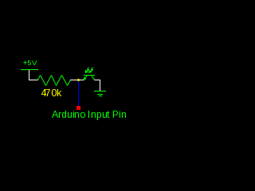

### Version 2 - Active Low inputs

Ultimatly, My intention is to use the circuit with current sensing detectors.  These may also be augmented with current optical detectors.  The current sensing detectors I have available to me (Mostly [NCE BD20](http://www.ncedcc.com/component/virtuemart/?page=shop.product_details&flypage=garden_flypage.tpl&product_id=63&category_id=16)s) are all active low devices.  This means they connect the input on the Arduino to a ground, instead of connecting the Arduino input to +5vdc.  In order to utilize these, we need to slightly adjust our phototransisotr arangement.  The same components are used, they are just connected in a different order, as shown below

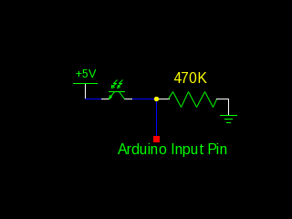

## The Completed Defect Detector

The completed detector is shown below.

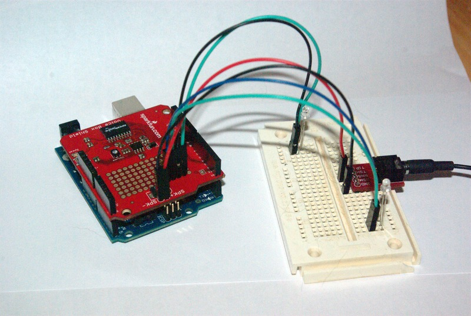

The breadboard on the right hand side of the image holds the two phototransistors and a 3.5mm audio jack.  The cable leading off the right edge goes to a pair of headphones I am using for testing.

Except for the phototransistor, the optical detector circuit is connstructed on the voicebox shield itself.

## Hardware Construction

### Populating the VoiceBox Shield

 We start with a VoiceBox shield as it arrives from Sparkfun:

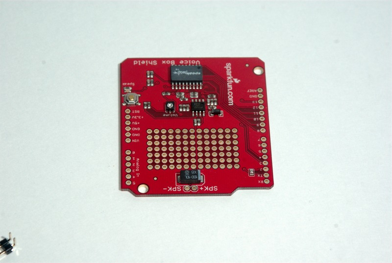)

and a set of connectors:

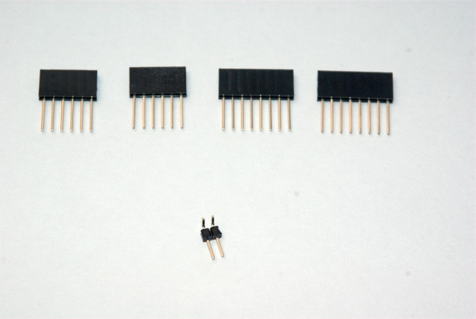

The top row of connectors are a Arduino Stackable headers.  You may substitute 0.1 inch spacing breakaway headers for these if you do not want to use the headers for off board connections.  The single connector on the bottom row is a 0.1 inch spacing 2 pin right angle header for the speaker.  You may substitute wires directly to the speaker if you prefer.

The first step is to solder the speaker connections to the voicebox shield

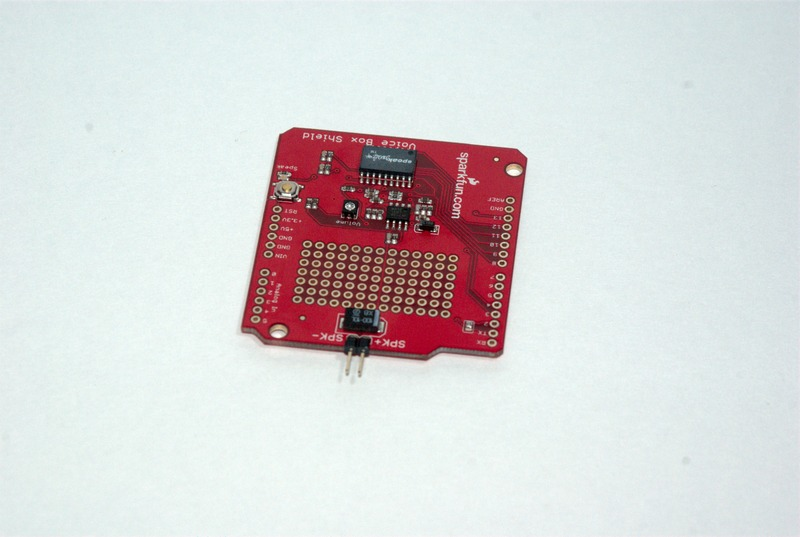

Next, we solder the headers on to the shield.  When doing this, I recommend starting by only soldering one pin on each end of the header.  Having only one pin soldered allows you to test fit the mounting on the Arduino, and adjust the alignment of the headers as necessary.  Once you are satisfied with the alignment, solder the rest of the pins of each of the 4 headers.

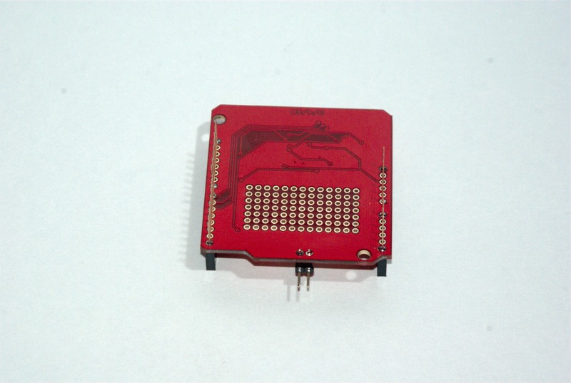

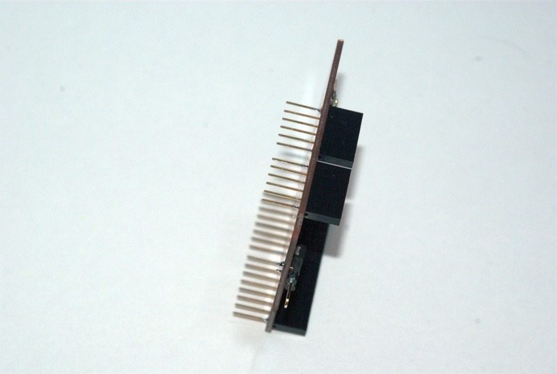

Once the headers are soldered, you can connect a speaker, program your Arduino. and test your build.  I have provided images of two possible speaker arangements below
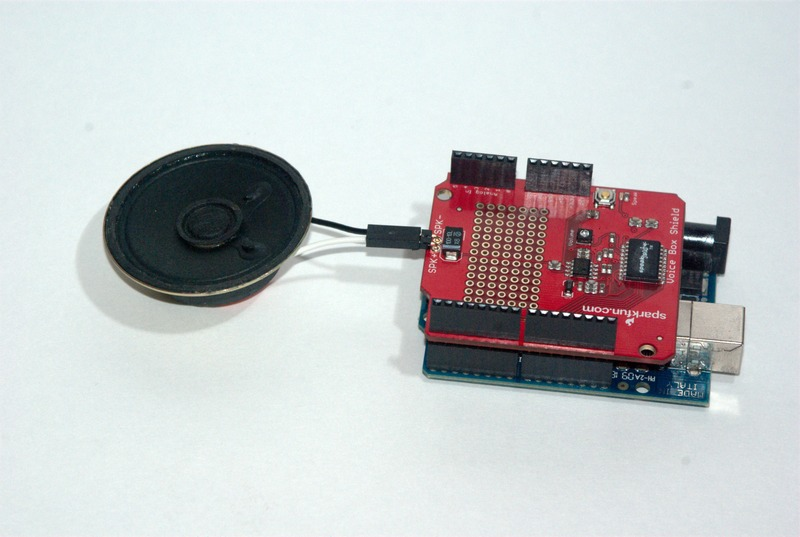

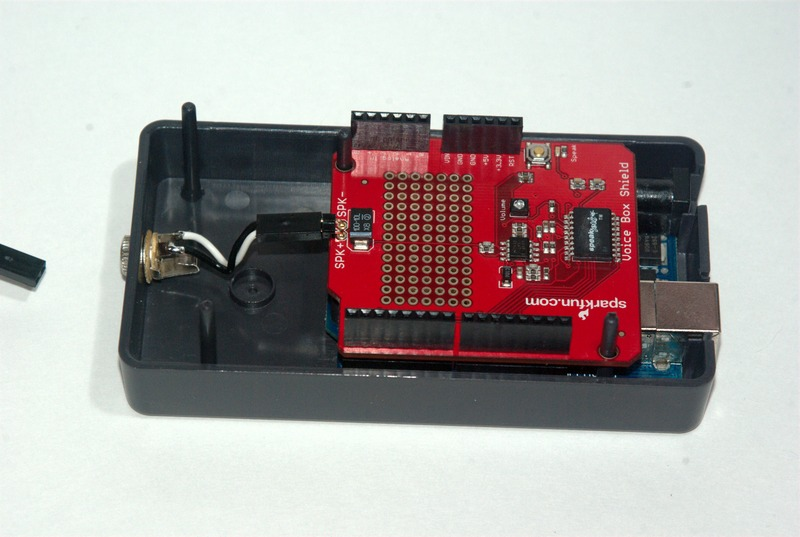

Testing at this point should result in the hotbox detector randomly going through the opening and closing message sequences.  This behavior will change when we connect inputs to the detector
### Inputs

#### Current Detection
I am utilizing an [NCE BD20](http://www.ncedcc.com/component/virtuemart/?page=shop.product_details&flypage=garden_flypage.tpl&product_id=63&category_id=16) for current detection.  The BD20 needs three wires connected to it to work with our circuit.  I have connected a red wire to the +5VDC terminal, a black wire to the Ground terminal, and a green wire to the logical output terminal.

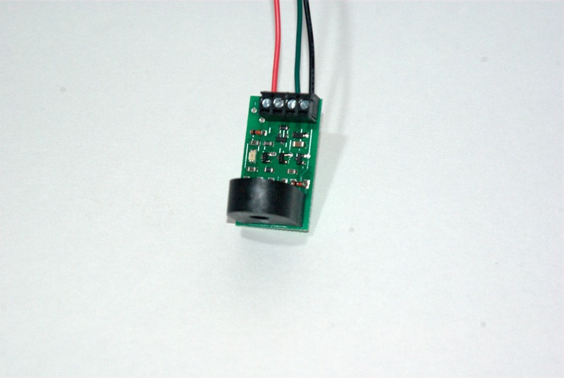

Connect the red wire to the Arduino +5VDC terminal, connect the black wire to ground, and connect the green wire to either pin 6 or pin 7.  To enable speed reports, connect the other pin to the second detector.

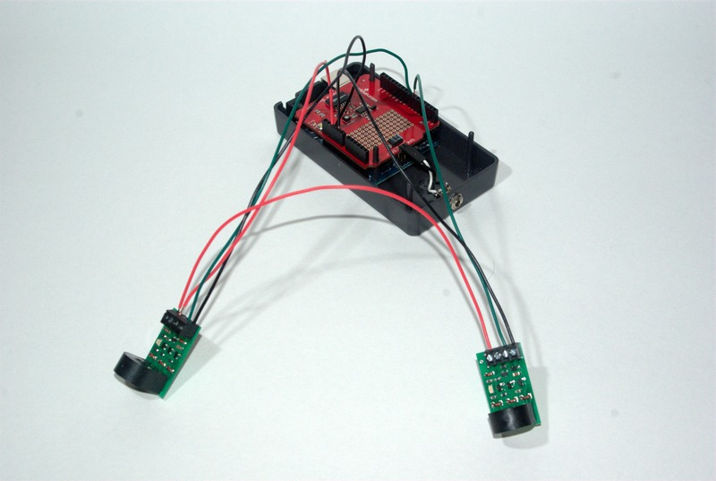

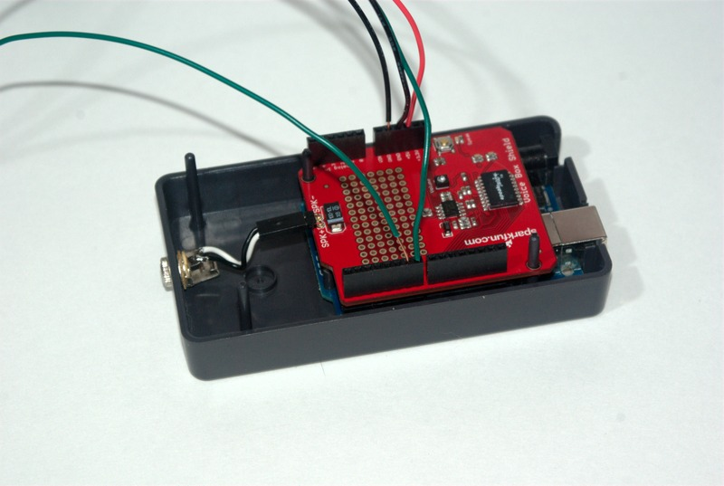

#### Optical Detection

The diagrams for two optical detection circuits have been outlined above.  The components required for both are shown below.  NOTE: the components shown are for two optical detectors, except there is one missing resistor (I ran out of 470K Ohm resistors for the photo).
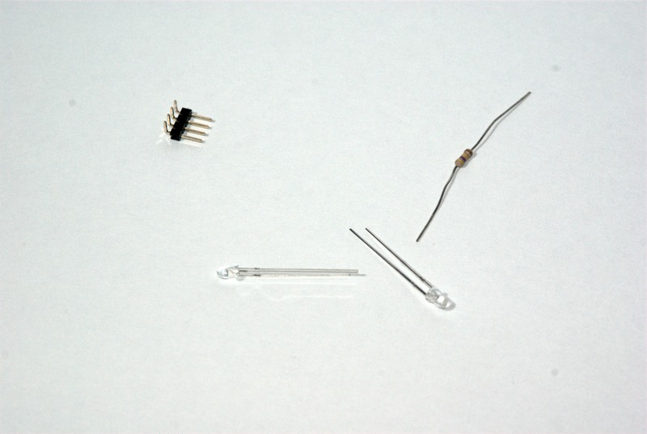

Start by soldering the 4 pin header into position.  I recommend soldering it near the digital input pins.

 choose one of the pins in each pair to solder the resistor next too.  When completed, the top of the board should look something like this
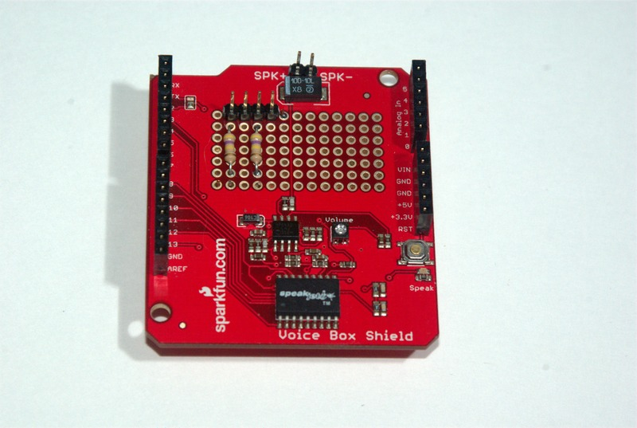

On the connector side of the resistors, create a solder bridge between the solder pads for the connector and the ones for the resistor.
Connect these combined pads to the inputs (pin 6 for one and pin 7 for the other).
Connect the oposite end of the resistors to ground.
Connect the two remaining pins on the connector to +5VDC
When finished, the board should look something like the following 
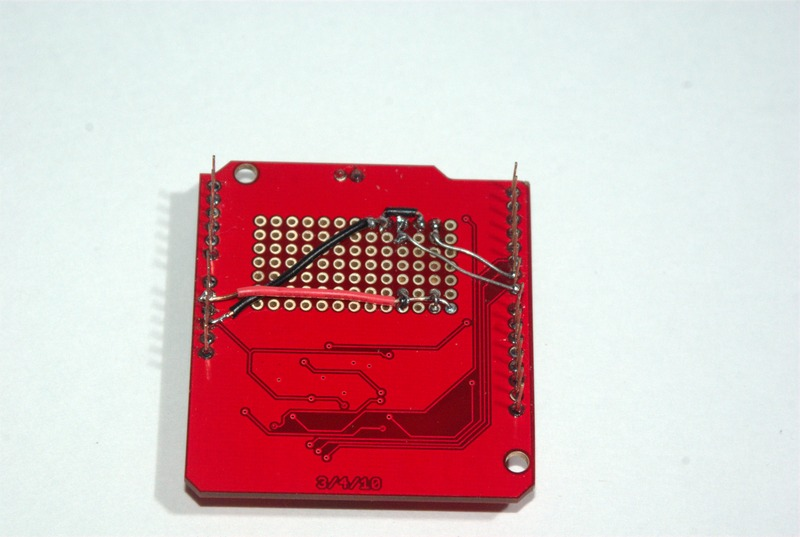

NOTE: To switch from active high to active low, reverse the ground and +5VDC connections.  The board above was originally wired this way, but has since had the black and red wires switched at the arduino pins (so black is +5VDC and red is ground in the photo above).

The only remaining task is to connect the phototransistors to the input circuit.  Remember these are polorized components, so if they don't work in the first time, try reversing the two leads that go to the device.

##### Dissabling Speed Reports
If you do not need speed reports, connect pin 7 or 6 (whichever one does not have the a detector connected to it) to the arduino 3.3V terminal.  This last connection will force the arduino to see the input as high.  (NOTE:If you are using active high detectors, this pin should be grounded instead).

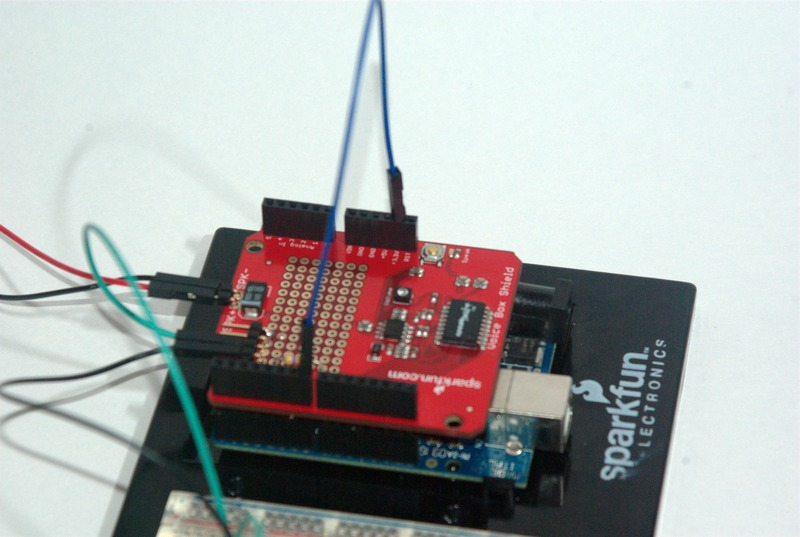

## Software (Version 1)

The Version 1 Software I have written represents a modern defect detector.  It has the following behavior

-When a train is detected (using Arduino I/O pin 6 or 7), the defect detector reports "Hotbox Detector Milepost 36.2" as a greeting
-After the greeting, the detector simulator <em>MAY</em> sound an alarm and report "Defects Detected".  This occurs randomly.
-If a defect was not detected, the detector reports:
    -"Hotbox Detector Milepost 36.2, No Defects, Detector Out" if only one of the two input sensor was triggered.
    -"Hotbox Detector Milepost 36.2, Speed 11, No Defects, Detector Out" if both inputs were triggered in the correct order

The milepost number can be changed with a variable in a header file.

If the speed is reported, it is calculated using the difference in trigger times between the first and second inputs.  The speed calculation assumes the input sensors are spaced 80 scale feet apart.

A software download for active high sensor inputs is available [here](HotBoxDetector.zip)

A software download for active low sensor inputs is available [here](HotBoxDetector_ActiveLow.zip)

## Example Output

-No Defects [mp3](recordings/Hotbox-NoDefects.mp3) [wav](recordings/Hotbox-NoDefects.wav)
-No Defects with Speed [mp3](recordings/Hotbox-NoDefectsWithSpeed.mp3) [wav]("recordings/Hotbox-NoDefectsWithSpeed.wav)
-Defect Detected [mpe](recordings/Hotbox-DefectDetected.mp3) [wav](recordings/Hotbox-DefectDetected.wav)

I have also posted a youtube video showing the device in operation on a test track:

<iframe width="560" height="315" src="https://www.youtube.com/embed/n8cO1lIXSyI" title="YouTube video player" frameborder="0" allow="accelerometer; autoplay; clipboard-write; encrypted-media; gyroscope; picture-in-picture" allowfullscreen></iframe>
